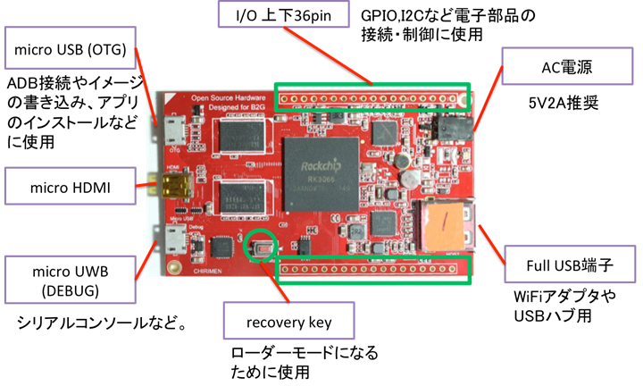

## CHIRIMENの準備

### 準備するもの
- CHIRIMEN
- USB-microUSBケーブル ※通常CHIRIMENに同梱されています。 CHIRIMEN-PCを接続するため、データ通信用(充電(のみ)用)ではダメです。
- microHDMI-HDMIケーブル ※通常CHIRIMENに同梱されています。 CHIRIMEN-モニタを接続するため
- CHIRIMEN用電源 ※通常CHIRIMENには電源ケーブル(USB-DC)が同梱されていますが、加えて USB Aで5V 1A以上（2A以上推奨）を給電可能な電源が別途必要となります。
- HDMIディスプレイ
- USBマウス

### CHIRIMEN の構成（起動する前に読んで）
- CHIRIMENのインターフェースは[こんな感じ](https://chirimen.org/docs/ja/board_connectors.html)です。 

### CHIRIMEN の接続
- 下図②microHDMI端子にディスプレイを接続します。
- 下図⑤Full USB端子にマウスを接続します。 
  下図ではUSB HUBを用いていますが、直接さすことも可能です。
- 上図micro USB(OTG)端子にPCを接続します。
- 下図④CHIRIMEN用電源ケーブルを接続します。
- CHIRIMEN上のLEDが点灯し、しばらく経つとB2Gが 起動する画面が現れます。
  - [Echigo rev.1 New firmware CMN2015-1_B2GOS-20170301](https://youtu.be/igPrE2pR8dw)
- アプリ画面が表示されたら、マウスを使用して操作をしてみましょう。 左クリックが選択、右クリックがホームボタンの役割となります

### 正しく起動しない場合
- 絵の通り配線はきちんとされているでしょうか？
- 電源ケーブルが抜けかかっている、HDMIケーブルがきちんとささっていないなどはないでしょうか？
- 物理的に正しくつながっていないケースが多いのでもう一度見直してみてください。
- 上記以外は、物理的にPCが認識しているかを確認する事が必要です。 
  PCが正しく認識しているか確かめる方法は、[adb コマンド](04.adb-command.md) を用いて確認します。
- [adb コマンド](04.adb-command.md) を用いても認識されない場合
  - 物理的に破損している可能性があります。
  - OSイメージがボードに正しく焼かれていない可能性があります。

### 正しく起動した場合
- B2G OSが表示されます。 

### 引用
- [CHIRIMEN Hello world](http://qiita.com/kotakagi/items/3a4f7865ab784cd88cdd) より引用
- [ボードコンピュータ　コネクタ配置](https://chirimen.org/docs/ja/board_connectors.html) より引用
