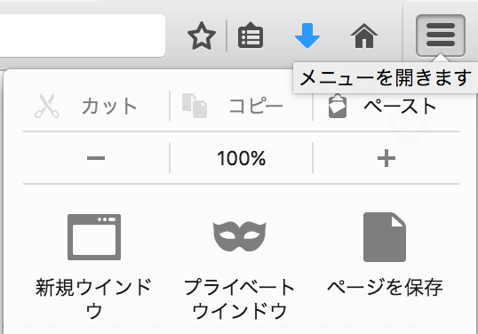
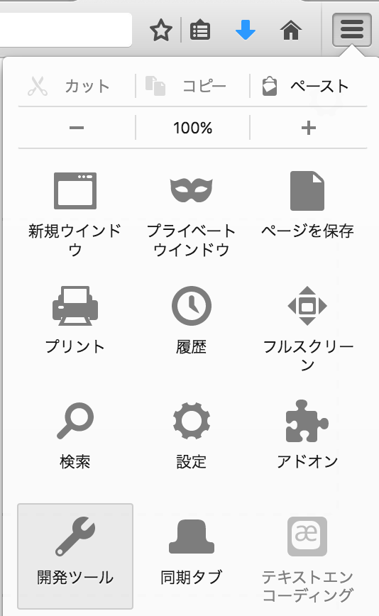
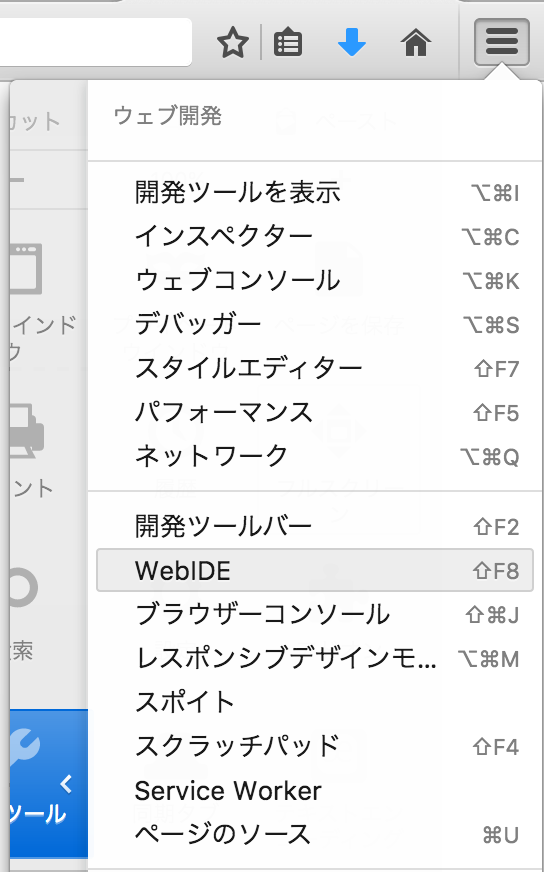

## WebIDE の使い方
### WebIDE の出し方
#### ● バーガーボタンをクリックします。

#### ● 開発ツールをクリックします。

#### ● WebIDEをクリックします。

#### ● WebIDE が表示されました。

### CHIRIMENの接続確認のやり方
- 下図のように「chirimen」と表示されていれば、接続OKです。 

- 表示されていない場合は、[adb コマンド](04.adb-command.md) を用いて確認します。 
  ※接続又は認識されていない表示例 

### アドオンインストールの確認のやり方
- 「シュミレータをインストール」をクリックします。 

- 下記コンポーネントがインストールされている事を確認します。
  - **ADB Helper アドオン（必須）**
  - **ツールアダプタアドオン（必須）**
  - Firefox OS x.x シミュレータ (任意)
  
