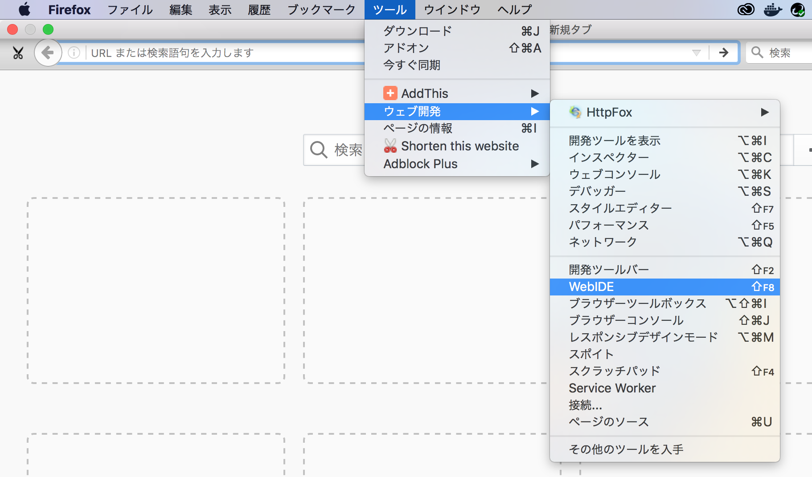
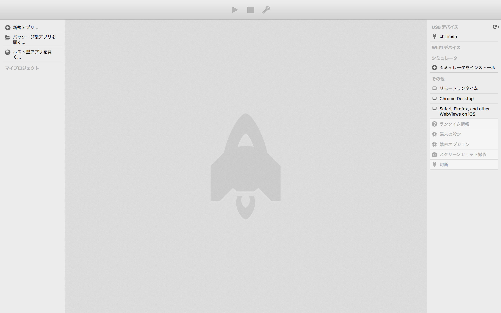
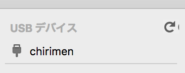
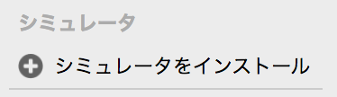
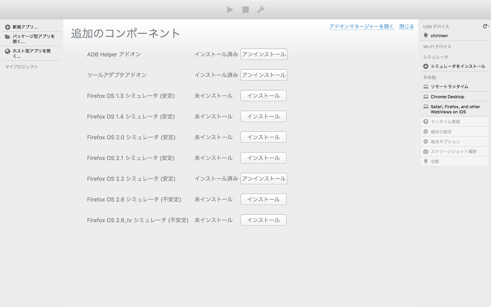

## WebIDE の使い方
### WebIDE の出し方
- メニューバー

- WebIDE が表示されました。

### CHIRIMENの接続確認のやり方
- 下図のように「chirimen」と表示されていれば、接続OKです。

### アドオンインストールの確認のやり方
- 「シュミレータをインストール」をクリックします。

- 下記コンポーネントがインストールされている事を確認します。
  - **ADB Helper アドオン（必須）**
  - **ツールアダプタアドオン（必須）**
  - Firefox OS x.x シミュレータ (任意)
