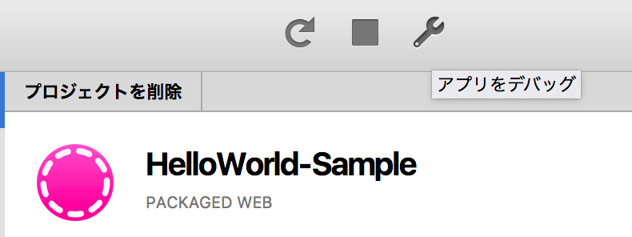
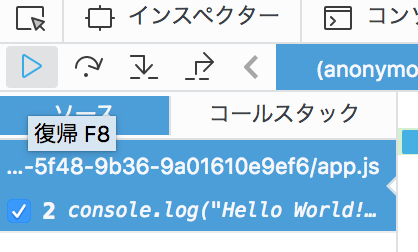

## デバッグのやり方

### デバッグ画面表示手順
- レンチマークのアイコンをクリックします。 

- WebIDEウィンドウ下部デバッグ画面が表示されます。 

- デバッガータブをクリックします。 

 
 

### デバッグの手順
- 任意の行にブレークポイントを設定します。 
  行番号をクリックすると下図のようになります。 

- 矢印マークの実行ボタンクリックします。 

- 設定されたブレークポイントでプログラムが一時停止します。 

 
 

### デバッグの進め方の種類
- 復帰（F8） 

- ステップオーバー（F10） 

- ステップイン（F11） 

- ステップアウト（↑+F11） 

