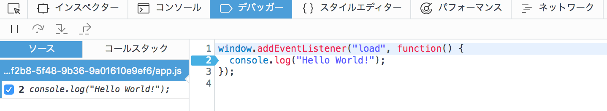

## デバッグのやり方

### デバッグ画面表示手順
- レンチマークのアイコンをクリックします。 

- WebIDEウィンドウ下部デバッグ画面が表示されます。 

- デバッガータブをクリックします。 

### デバッグの手順
- 任意の行にブレークポイントを設定します。 
  行番号をクリックすると下図のようになります。 

- 矢印マークの実行ボタンクリックします。 

- 設定されたブレークポイントでプログラムが一時停止します。 

### デバッグの進め方の種類
#### ● 復帰（F8）

#### ● ステップオーバー（F10）

#### ● ステップイン（F11）

#### ● ステップアウト（↑+F11）

