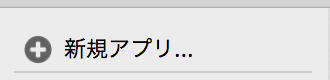
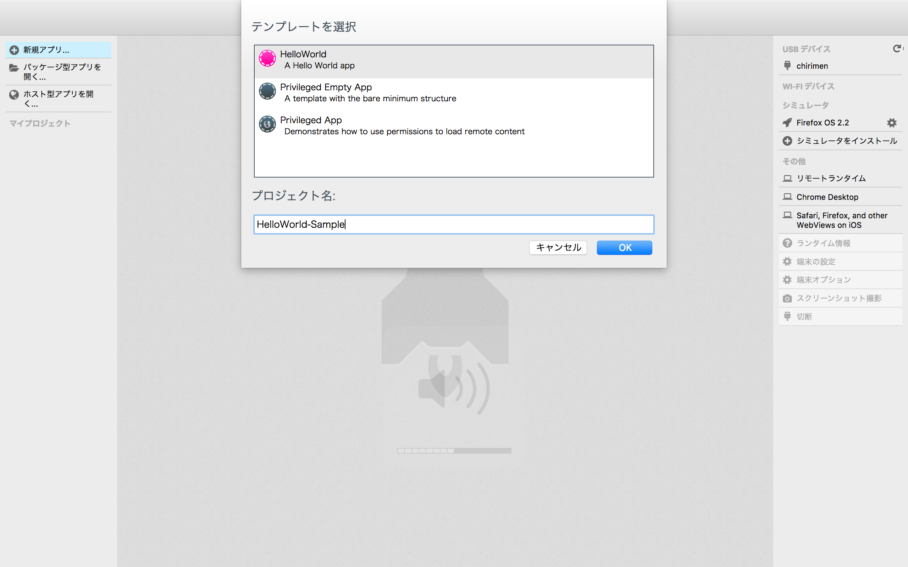
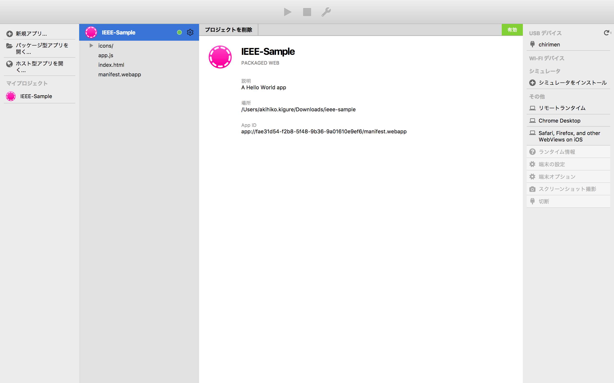
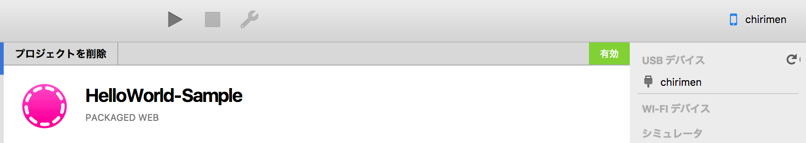
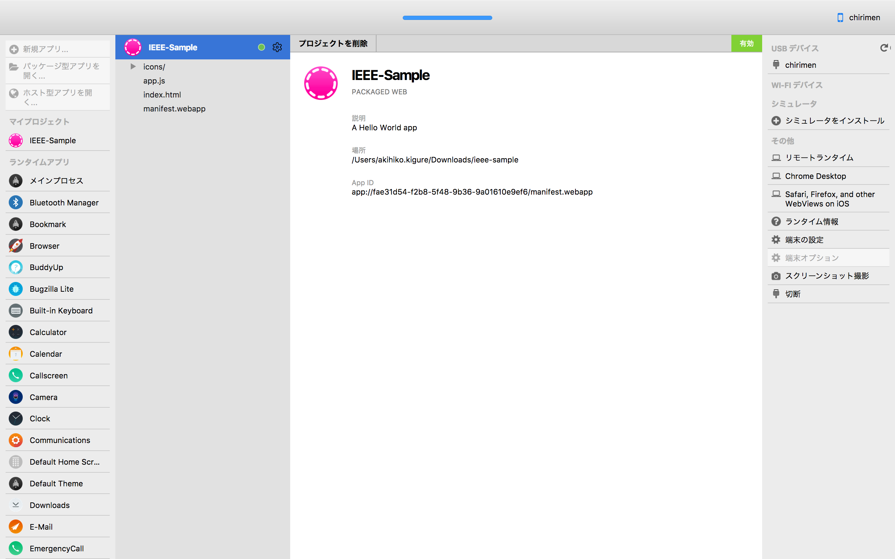
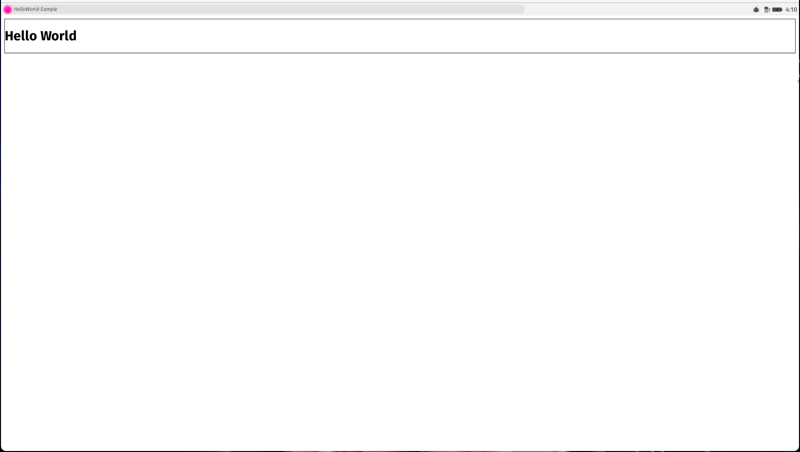

## Hello World の作り方

### Hello World の作成の手順
- 新規アプリをクリックします。 

- 新規アプリ名を入力し「OK」クリックします。

- 新規アプリ名のプロジェクトが作成されました。

### Hello World のインストールのやり方
- USBデバイスに表示されている「chirimen」をクリックします。
- △マークの実行ボタンが押せるようになります。 

- △マークの実行ボタンをクリックし、アプリケーションをインストールします。 

- アプリケーションが起動するとCHIRIMMENに接続したディスプレイが下図のようになります。 

