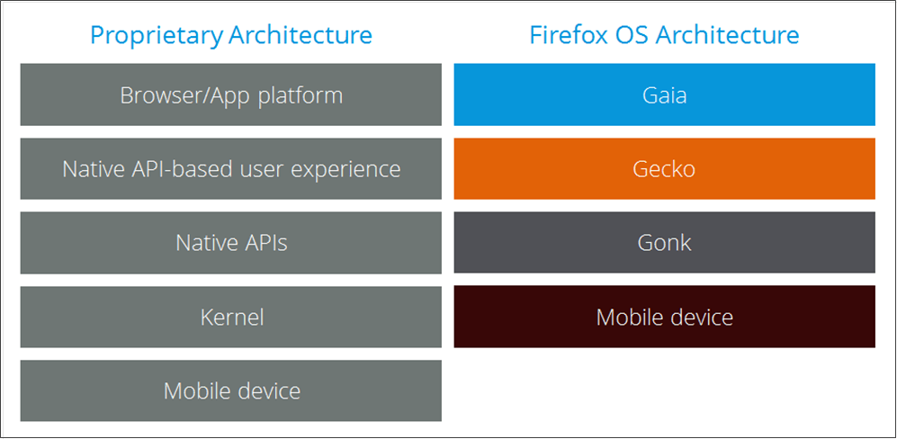

## B2G OSとは

### B2G OS の用語
- B2G OS のドキュメントをさらに読み進める前に理解しておくべき用語がいくつかあります。

### B2G
- Boot to Gecko の略語です。

### Boot to Gecko
```
B2G OS オペレーティングシステムのエンジニアリングコードネームです。
プロジェクトに正式な名称がつくまでの長い間この言葉が使われたため、
これが B2G OS を指す言葉として使われるのをよく見るでしょう。
```

### Q. Boot to Gecko とは何ですか。Firefox OS とは違うのですか。
```
Boot to Gecko と Firefox OS はコード的には同じモノです。
品質やセキュリティなどの条件を満たした上で、Mozilla からブランドの使用許諾を得ている製品だけが
Firefox OS 搭載を謳えます。ブランド使用許諾無しで OSS として使用する場合は
Boot to Gecko(B2G) になります。
```

### アーキテクチャの全体像
#### 以下の図は、プロプライエタリなプラットフォームと B2G OS<br> のアーキテクチャを比較したものです。



#### 引用
- [B2G OS のアーキテクチャ](https://developer.mozilla.org/ja/docs/Archive/B2G_OS/Architecture) より引用
- [B2G](https://wiki.mozilla.org/B2G) より引用
- [CHIRIMEN FAQ](https://chirimen.org/docs/ja/FAQ.html) より引用
